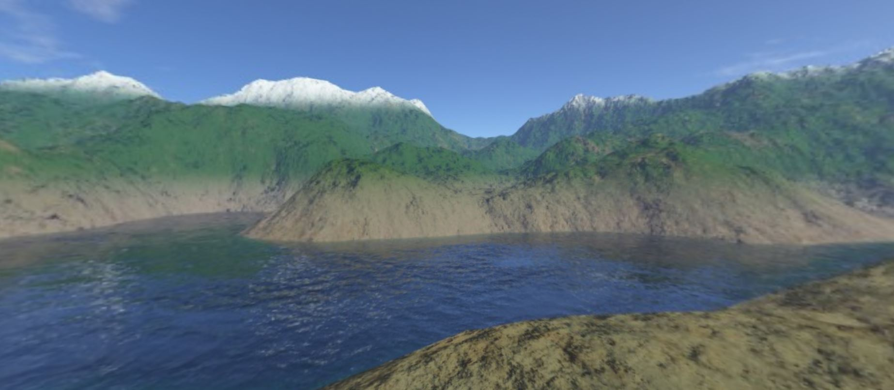
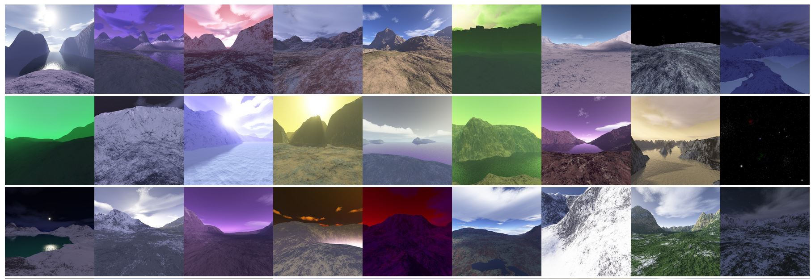

# WebGL World using Three JS and PhoneGap

Illusion of 3 enviroments using WebGL (with Three JS) and PhoneGap.



## Getting Started

You'll need an Adobe account in order to build the application for mobile, however you can just run it in your web browser (Firefox and Chrome are recommended for this).

The application will be an illusion of an enviroment using an inverted skybox and an orbital camera, the libraries are already in the project js folder.

### Prerequisites

You'll need an Adobe account, and a way to run a server from tour machine as three.js run only in a server. Three JS already wrote an article about this here:


https://threejs.org/docs/#manual/en/introduction/How-to-run-things-locally


We are using skyboxes in a 6-texture format, so this website is perfect for adding more enviroments if you want to:


http://www.custommapmakers.org/skyboxes.php




### Code explanation

1. Create a camera and a renderer to show the content.

```
scene = new THREE.Scene();
camera = new THREE.PerspectiveCamera(55,window.innerWidth/window.innerHeight,45,90000);
camera.position.set(-900,-200,-900);
renderer = new THREE.WebGLRenderer({antialias:true});
renderer.setSize(window.innerWidth,window.innerHeight);
```

2. Attach it to the HTML document.

```
document.body.appendChild(renderer.domElement);
```

3. Instantiate an orbit control. Disable the pan gesture and set a min and max zoom distance to avoid breaking the illusion af the world.

```
controls = new THREE.OrbitControls(camera, renderer.domElement);
controls.addEventListener('change', renderer);
controls.enablePan = false;
controls.minDistance = 200;
controls.maxDistance = 3500;
```

4. Load the textures for the material and add them into an array, which will be our material.

```
let materialArray = [];
var front, back, up, down, right, left;
```

```
front = new THREE.TextureLoader().load('img/valley_ft.jpg');
back = new THREE.TextureLoader().load('img/valley_bk.jpg');
up = new THREE.TextureLoader().load('img/valley_up.jpg');
down = new THREE.TextureLoader().load('img/valley_dn.jpg');
right = new THREE.TextureLoader().load('img/valley_rt.jpg');
left = new THREE.TextureLoader().load('img/valley_lf.jpg');  
```

```
materialArray.push(new THREE.MeshBasicMaterial( { map: front }));
materialArray.push(new THREE.MeshBasicMaterial( { map: back }));
materialArray.push(new THREE.MeshBasicMaterial( { map: up }));
materialArray.push(new THREE.MeshBasicMaterial( { map: down }));
materialArray.push(new THREE.MeshBasicMaterial( { map: right }));
materialArray.push(new THREE.MeshBasicMaterial( { map: left }));
```

5. The camera will be inside a cube seeing the sybox from the inside, so the textures we assign must be inverted.

```
for (let i = 0; i < 6; i++){
  materialArray[i].side = THREE.BackSide;
}
```

6. Create a cube geometry and assign the material to it.

```
skyboxGeo = new THREE.BoxGeometry( 10000, 10000, 10000);
skybox = new THREE.Mesh( skyboxGeo, materialArray );
scene.add( skybox );  
```

7. Start rendering the scene into the camera and create a loop for the render.

```
renderer.render(scene,camera);
requestAnimationFrame(animate);
```

### Extra functionalitites

1. WebGL won't change the scene size or orientation by default, so we need to update the scene in an onWindowResize event.

```
window.addEventListener( 'resize', onWindowResize, false );
function onWindowResize(){
  camera.aspect = window.innerWidth / window.innerHeight;
  camera.updateProjectionMatrix();
  renderer.setSize( window.innerWidth, window.innerHeight );
}
```

2. If you want to change the skybox material everytime, youll need to create the material with updated textures. The easiest way is to create the scene again, but this have a problem of trash stacking in the memory when reloading the scene. The solution to this is quite simple, as the only thing we need to do is to remove the objects and renderer from the scene and removing the canvas from the HTML everytime we load a new scene.

```
if (scene != null) {
  scene.remove(skyboxGeo);
  scene.remove(skybox);
  scene.remove(camera);
  scene.remove(renderer);
  scene.remove(controls);
  document.body.removeChild(renderer.domElement);
}
```

### Installing

First of all we need to run a local server. Three JS already has documentation with saveral ways of running locally.

https://threejs.org/docs/#manual/en/introduction/How-to-run-things-locally

After the server is running, just go to the www folder in your localhost from your browser and the application will start running the index.html file.

http://localhost:8000/OpenWorld/www

It is recommended that you use Firefox or Chrome in order to run the application, but Edge should work fine too.

## Deployment

Compress the www folder into a ZIP file (www.zip).

Go to Adobe PhoneGap website (https://build.phonegap.com/) and log-in.

Open the Apps tab (PhoneGap will only allow one private application per free user, so use github if you have more than one private app).

Upload your zip.

Build for Android or iOS.

Install the apk or the ipa via xCode.


## Built With

* [Three JS](https://github.com/mrdoob/three.js/) - The WebGL library used
* [Orbit Controls](https://threejs.org/docs/#examples/en/controls/OrbitControls) - Camera movement
* [PhoneGap](https://build.phonegap.com/) - Used to compile the mobile apps.


## Authors

* **Ivan Pedrero** - *Initial work* - [IvanPedrero](https://github.com/IvanPedrero)


## Acknowledgments

Based on the 3D world tutorial by Red Stapler (https://www.youtube.com/watch?v=cp-H_6VODko).
